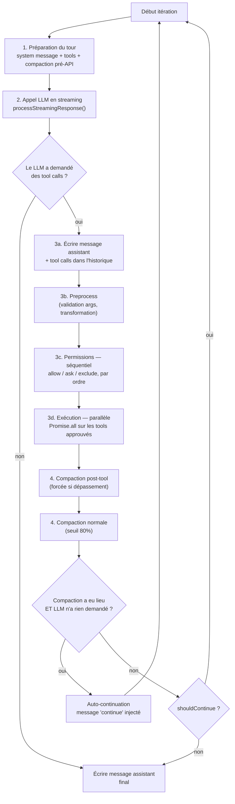

# La boucle agentique du fork — investigation, forces/faiblesses, comparaison

**Statut** : notes d'investigation technique, pas un document d'exigences (pas de REQ ici). Sert de base à de futures exigences du domaine AGENT (`SPEC.md` §3.2.5) si des changements sont décidés.

**Périmètre** : la boucle du **CLI** (`extensions/cli`), cible réelle de la Phase 1 (`SPEC.md` §1.2). Le GUI (extension VS Code, `gui/src/redux/thunks/streamNormalInput.ts` et associés) a sa **propre implémentation, distincte**, non couverte en détail ici — mentionnée seulement pour signaler la duplication (cf. Faiblesses).

**Méthode** : lecture directe du code (pas de résumé de mémoire), le 2026-09-10. Fichiers cités avec chemin exact.

---

## 1. Vue d'ensemble

Point d'entrée : `extensions/cli/src/stream/streamChatResponse.ts:423`, fonction `streamChatResponse()`. Une boucle `while (true)` plate — **pas de récursion** — où chaque itération est un aller-retour complet avec le LLM.



---

## 2. Étape par étape

### 2.1 Préparation du tour (`streamChatResponse.ts:444-478`)

À chaque itération, sans mise en cache :
1. `services.systemMessage.getSystemMessage(currentMode)` — recalculé, peut changer si le mode de permission change en cours de run.
2. `getRequestTools(isHeadless)` (`handleToolCalls.ts:172`) — filtre les tools par permission : un tool en `ask` n'est **même pas envoyé au LLM** en mode headless (il ne peut jamais être approuvé sans interaction, donc autant ne pas le proposer).
3. `handlePreApiCompaction` — compaction si le contexte est déjà trop gros avant même d'appeler le LLM.

### 2.2 Appel LLM en streaming (`processStreamingResponse`, ligne 197)

Lecture chunk par chunk (`for await (const chunk of streamWithBackoff)`), format OpenAI. Deux flux accumulés séparément :
- **Texte** : `choice.delta.content` → concaténé dans `aiResponse`.
- **Tool calls** : `choice.delta.tool_calls` → chaque delta est fragmenté (un tool call arrive sur plusieurs chunks), reconstruit via `processToolCallDelta` (`streamChatResponse.helpers.ts:184`) qui accumule `argumentsStr` et tente un `JSON.parse` à chaque delta jusqu'à obtenir un JSON complet.

Fin de stream : les tool calls sans nom sont filtrés (incomplets), et `shouldContinue = toolCalls.length > 0` — c'est ce booléen qui pilote la sortie de la boucle.

### 2.3 Traitement des tool calls (`handleToolCalls.ts`)

**3a. Historique.** Le message assistant (texte + tool calls demandés) est écrit avant tout traitement — l'historique reflète ce que le LLM a *demandé*, indépendamment de ce qui sera *autorisé*.

**3b. Preprocess** (`preprocessStreamedToolCalls`) — par tool call, indépendamment des autres :
- Résout le tool par nom, valide la présence des arguments requis.
- Si le tool a une méthode `preprocess`, transforme ses arguments avant exécution (ex. résolution de chemin, normalisation).
- Un échec ici produit une entrée d'erreur immédiate **sans bloquer les autres tool calls** du même tour.

**3c. Permissions — séquentiel, volontairement** (`executeStreamedToolCalls`, `streamChatResponse.helpers.ts:496`) :

Chaque tool call est vérifié dans l'ordre d'apparition, via `checkToolPermission` (`permissionChecker.ts:128`) :

```
basePermission = "ask"  // fail-closed par défaut
pour chaque policy dans permissions.policies (dans l'ordre) :
    si matchesToolPattern(nom_tool, policy.tool, args)      // ex. "Bash(git status*)"
       ET matchesArguments(args, policy.argumentMatches) :
        basePermission = policy.permission   // premier match gagne, on arrête
        break
```

`matchesToolPattern` (`permissionChecker.ts:17`) gère trois formes : wildcard générique (`external_*`), motif spécial `Bash(commande*)` (compile le motif en regex, ne matche que si l'argument `command` du tool `Bash` correspond), et égalité stricte.

Point de sécurité notable : si le tool a une évaluation dynamique (`tool.evaluateToolCallPolicy`), celle-ci **ne peut que durcir** — si elle renvoie `disabled`, ça l'emporte toujours sur la policy statique ; sinon, c'est la policy statique qui prévaut (`permissionChecker.ts:161-173`). Une évaluation dynamique ne peut jamais *accorder* plus qu'une règle statique ne l'a explicitement fait.

Le refus (`ask` rejeté par l'utilisateur, ou `exclude`) produit une entrée `canceled` **et le code continue sur le tool call suivant** — commentaire explicite dans le code : *"Do not cancel subsequent tools after a rejection; handle each independently"* (`streamChatResponse.helpers.ts:497`).

**3d. Exécution — parallèle** (ligne 559) : chaque tool call approuvé est lancé immédiatement dans `execPromises`, sans attendre la fin des autres ; rassemblement final via `await Promise.all(execPromises)` (ligne 638). Chaque exécution reçoit `parallelToolCallCount` (le nombre total de tools en vol dans ce tour) afin qu'un tool comme `Bash` ou `Read` puisse réduire sa propre limite de sortie et éviter de saturer le contexte à plusieurs en même temps.

Statuts finaux par tool call : `done`, `errored`, ou `canceled` — pas de statut global pour le tour, un statut individuel par tool call.

### 2.4 Compaction du contexte (`streamChatResponse.compactionHelpers.ts`)

Trois points de contrôle distincts :
- **Pré-API** — avant l'appel LLM, si déjà trop gros.
- **Post-tool forcé** — si les résultats de tools viennent de faire déborder le contexte : compaction forcée immédiatement, peu importe le seuil habituel. Si la compaction ne suffit pas à repasser sous la limite → `throw` (arrêt franc, pas de dégradation silencieuse).
- **Normal, seuil 80%** — vérification de routine en fin de tour.

Si une compaction a eu lieu **et** que le LLM n'avait pas demandé de continuer, le système injecte lui-même un message `"continue"` (`handleAutoContinuation`, `streamChatResponse.ts:95`) pour reprendre après le résumé — sinon la conversation s'arrêterait net juste après avoir perdu du contexte.

### 2.5 Condition de sortie

`if (!shouldContinue && !shouldAutoContinue) break;` (`streamChatResponse.ts:578`) — seule condition d'arrêt visible dans ce fichier.

---

## 3. Forces

1. **Boucle plate, non récursive** — un seul point d'entrée, facile à tracer. Contraste avec le GUI qui se rappelle lui-même (`depth+1`).
2. **Séparation stricte permission (séquentielle) / exécution (parallèle)** — la sécurité ne dépend jamais de l'ordre de complétion d'une promesse, seulement l'exécution.
3. **Fail-closed par défaut** — `basePermission = "ask"` si aucune règle ne matche ; jamais d'`allow` implicite.
4. **La policy dynamique ne peut que durcir**, jamais adoucir une règle statique plus stricte — defense in depth, pas de bypass possible via une évaluation complaisante.
5. **Le mécanisme de pattern `Bash(cmd*)` existe déjà et est directement réutilisable** pour la liste blanche de commandes shell en lecture seule prévue en `SPEC.md` REQ-EDIT-101/102 — rien à construire, juste à peupler la config de policies avec les motifs voulus.
6. **Feedback UI granulaire** : statut "calling" marqué avant exécution, statut individuel (`done`/`errored`/`canceled`) par tool call plutôt que par tour.
7. **`parallelToolCallCount` anticipe la saturation de contexte** causée par un fan-out massif de tools.
8. **Compaction à 3 points de contrôle avec arrêt franc** (`throw`) si elle échoue — pas de silence sur un dépassement de contexte non résolu.

## 4. Faiblesses

1. **Aucune limite de concurrence sur `Promise.all`** — un tour avec 50 tool calls les lance tous en même temps, sans throttle (déjà identifié pour le tool `Subagent` spécifiquement dans `SPEC.md` §7.5/3.2.5, confirmé ici comme un problème général du mécanisme, pas spécifique aux sous-agents).
2. **Le refus d'un tool call n'annule pas les autres du même tour** — à valider explicitement : si un tool interdit dans un batch est un signal que le tour entier est suspect, le comportement actuel laisse quand même s'exécuter les tools légitimes du même batch.
3. **Duplication logique CLI/GUI** — deux implémentations distinctes de la boucle et de la gestion des permissions/tool calls. Un correctif de sécurité ou de comportement fait dans l'une n'est pas automatiquement répercuté dans l'autre.
4. **Pas de plafond global de tours** dans le `while(true)` — la seule limite indirecte est la longueur du contexte (et la compaction qui la repousse). Un agent qui boucle indéfiniment sur des tool calls valides (ex. edit → erreur → edit) n'a pas de garde-fou visible ici (à distinguer du plafond spécifique de tentatives `multiEdit`, REQ-EDIT-060, qui est local à un seul tool, pas global à la boucle).
5. **Complexité accidentelle du double chemin service/fallback** — le pattern `if (chatHistorySvc?.isReady()) {...} else {...}` est répété à ~5 endroits (`refreshChatHistoryFromService`, `handleAutoContinuation`, `executeStreamedToolCalls`, chaque helper de compaction) : deux sources de vérité possibles pour l'historique, deux chemins à tester à chaque changement.
6. **Stratégie de compaction non affinée** (non vérifiée en détail — `streamChatResponse.autoCompaction.ts` non lu dans cette investigation) : la logique semble déclencher un résumé global plutôt qu'une troncature ciblée des plus gros résultats de tools. À creuser si la compaction s'avère un point de friction en usage réel.
7. **Pas de mode background pour un tool call individuel long** — `Promise.all` attend le plus lent du batch avant de rendre la main au LLM ; aucun mécanisme pour continuer à traiter d'autres choses pendant qu'une commande longue tourne.

---

## 5. Comparaison avec les autres outils

Basée sur les recherches documentaires faites dans cette session (sourcées) — pas sur une lecture de leur code source, qui n'est pas public pour Claude Code ni Mistral Vibe. Écarts marqués "non vérifié" plutôt que devinés.

| Aspect | Ce fork (Continue CLI) | Claude Code | Codex CLI / Agents SDK | Mistral Vibe |
|---|---|---|---|---|
| Boucle agentique | Plate, `while(true)`, un seul niveau, non récursive | Non documentée publiquement en détail au niveau code ; comportement observable = boucle standard, sous-agents lancés via un tool dédié sans récursion visible côté utilisateur | Deux modes explicitement documentés : orchestration **"via code"** (déterministe) ou **"via LLM"** (dynamique), avec handoffs et agents-as-tools comme primitives nommées | Non vérifié en détail |
| Parallélisme des tool calls | Oui, générique, **sans limite de concurrence** | Oui (plusieurs tool_use blocks par tour, exécutés concurremment côté client) | Oui, pattern documenté (`asyncio.gather`) dans le SDK | Non vérifié |
| Restriction d'outils par sous-agent | **Non** — un sous-agent reçoit tous les tools (`executor.ts:78-89`, `allow` sur `*`) ; cf. `SPEC.md` REQ-AGENT-030/031 | Oui — agents typés par capacité (ex. agent d'exploration en lecture seule, distinct d'un agent à accès complet) | Oui, via le typage des agents/handoffs dans le SDK | Non vérifié |
| Effort de raisonnement | Absent — à construire (`SPEC.md` REQ-AGENT-060/061/062) | Échelle graduée `low/medium/high/xhigh/max` | Échelle étendue selon modèle (`none` à `max`) | Binaire `high`/`none`, 2 modèles seulement |
| Skills | `SKILL.md`, standard ouvert (déjà le format de ce fork, `SPEC.md` §3.2.2) | Standard d'origine | Adopte le même standard | Adopte le même standard (dans Vibe uniquement, absent de l'Agents API générale) |
| Rejet partiel d'un batch de tool calls | Rejet individuel, le reste du batch continue | Non vérifié | Non vérifié | Non vérifié |
| Mode background pour un tool long | Absent | Documenté publiquement pour l'exécution de commandes shell en arrière-plan avec suivi de sortie asynchrone | Non vérifié en détail | Non vérifié |

---

## 6. Pistes d'amélioration et inspiration

| Faiblesse | Piste | Inspiration |
|---|---|---|
| Pas de limite de concurrence | Plafonner le nombre de tool calls exécutés simultanément (ex. `p-limit`) | Décision d'ingénierie interne — aucun vendor n'a documenté publiquement une valeur ou un mécanisme précis à copier ici |
| Pas de restriction d'outils par sous-agent | Allow-list par type de sous-agent | Claude Code (agents typés par capacité) — déjà acté en `SPEC.md` REQ-AGENT-030/031 |
| Effort de raisonnement absent | Échelle unifiée mappée par provider | LiteLLM (prior art vérifié) — déjà acté en `SPEC.md` REQ-AGENT-060/061/062 |
| Duplication logique CLI/GUI | Modéliser sous-agents et tool-loop comme une primitive unique partagée plutôt que deux boucles maintenues séparément | Vocabulaire explicite du SDK Agents d'OpenAI (agents-as-tools, handoffs) comme référence conceptuelle pour unifier plutôt que dupliquer |
| Rejet partiel d'un batch non tranché | Décider explicitement : annulation du reste du batch sur un premier refus, ou statu quo (indépendance totale) | Question ouverte, pas de prior art identifié dans cette investigation |
| Pas de mode background | Étudier un mécanisme de suivi asynchrone pour les commandes longues | Claude Code (exécution shell en arrière-plan documentée publiquement) |

---

## 7. Suite

Rien ici n'est une exigence opposable. Les points déjà actés en REQ (restriction d'outils, effort) sont dans `SPEC.md` §3.2.5. Les points encore ouverts (limite de concurrence globale, rejet partiel de batch, duplication CLI/GUI, mode background) sont à trancher avant toute formalisation.
